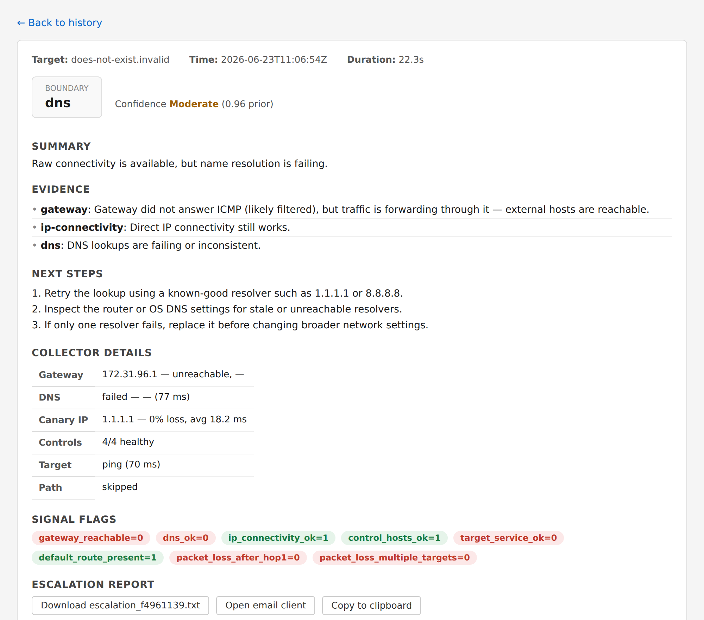

# Boundary Probe

[](https://github.com/inth3shadows/boundary-probe/actions/workflows/ci.yml)
[](https://www.python.org/)
[](LICENSE)
[]()

`boundary-probe` is a CLI tool for deterministic network boundary diagnosis. It runs a targeted set of probes, classifies the most likely failure boundary with a confidence score, and gives the operator specific remediation steps — not generic advice.

The five boundaries it answers: **local device / LAN**, **router-gateway**, **DNS**, **ISP upstream path**, and **remote service**. Every result is backed by evidence collected in the same run and stored locally in SQLite for history review.

## Demo

The local web UI (`boundary-probe ui`) shows each run's boundary verdict, confidence band, evidence, collector measurements, and raw signal flags. Here it is catching a DNS failure — connectivity is up, but name resolution is down:



Prefer the terminal? `boundary-probe diagnose <target>` prints the same diagnosis as plain text. To try it yourself: `pip install boundary-probe` then `boundary-probe diagnose 8.8.8.8`.

## How It Works

`boundary-probe diagnose <target>` runs six collectors sequentially — gateway ping, DNS resolution, IP-level canary ping, control-host quorum check, target-service reachability, and a traceroute path analysis — then feeds the results into a deterministic rule engine. The engine emits a boundary classification, a confidence score, and an evidence-backed remediation list. Every run is persisted to a local SQLite database.

The rule engine is intentionally deterministic: same signals → same result, every time. Probabilistic layers and LLM-assisted diagnosis are deferred until the rules are calibrated on real-world captures.

## Prerequisites

**Windows 10/11:**
- Python 3.11 or newer
- `ping.exe`, `tracert.exe`, and `route.exe` on PATH (standard on all supported Windows versions)

**Linux (Ubuntu 20.04+, Debian, Fedora, Arch):**
- Python 3.11 or newer
- `ping`, `traceroute`, and `ip` (iproute2) — install with `sudo apt install traceroute iputils-ping iproute2`

No additional runtime dependencies — stdlib only.

## Quick Start

**Windows (PowerShell):**
```powershell
python -m venv .venv
.venv\Scripts\Activate.ps1
pip install -e .[dev]
```

**Linux:**
```bash
python -m venv .venv
source .venv/bin/activate
pip install -e .[dev]
```

Diagnose a target:

```bash
boundary-probe diagnose example.com
boundary-probe diagnose https://app.example.com
boundary-probe diagnose 1.1.1.1
```

Skip the traceroute for a faster result:

```bash
boundary-probe diagnose example.com --no-path
```

View recent run history:

```bash
boundary-probe diagnose --history 10
```

Capture a fixture from a live run (for testing or sharing):

```bash
boundary-probe capture my-snapshot --target example.com
```

Configuration is optional — the defaults work out of the box. To view the
effective settings and the config file path:

```bash
boundary-probe config
```

See [Configuration](USAGE.md#configuration) for the full TOML schema (probe
hosts, thresholds, timeouts) and the `BOUNDARY_PROBE_CONFIG` override.

Run tests:

```bash
pytest
pytest -m integration   # requires live network
```

## Project Structure

```
src/boundary_probe/
    cli.py              Entry point — subcommands: diagnose, capture, roadmap
    engine.py           Deterministic rule engine and confidence tiers
    models.py           SignalSnapshot (7 booleans), Diagnosis, EvidenceItem
    targets.py          Target parser — host / IP / URL classification
    normalizer.py       Path signal normalizer — persistent-loss detection
    collectors/         Windows subprocess collectors (ping, tracert, DNS, TCP)
    store/              SQLite persistence — schema, insert, fetch
    templates/          Escalation template generators (Phase 4)
tests/
    fixtures/           JSON signal snapshots and raw ping/tracert text fixtures
    test_engine.py      Rule engine unit tests
    test_parsers.py     ping/tracert/route-print parser tests
    test_collectors_unit.py  Per-collector tests with FakeRunner (no network)
    test_normalizer.py  Path normalizer algorithm tests
    test_store.py       SQLite schema and round-trip tests
    test_cli.py         CLI integration tests (monkeypatched collectors)
    test_collectors_integration.py  Live-network tests (gated: -m integration)
docs/
    product-brief.md          Product framing and scope
    architecture-decision.md  Chosen product shape and phased delivery
    technical-direction.md    Architecture and implementation path
    rules-engine.md           Rule model and confidence design
```

## Phase Status

| Phase | Scope | Status |
|-------|-------|--------|
| 0 | Scaffold — rule engine, CLI stub, target parser, fixtures | Done |
| 1 | Real collectors, path normalizer, SQLite persistence | Done |
| 2 | Rich signal facts, config file, collector details output | Done |
| 3 | Local web UI | Done |
| 4 | Escalation output (clipboard + .txt) | Done |
| 5 | Hardening and calibration | Done |
| 6 | Linux support, CI, PyPI packaging | Done |

## Related Documentation

- [Technical Reference](TECHNICAL.md) — architecture, collector design, deployment, maintenance
- [Usage Guide](USAGE.md) — end-user guide for running diagnoses and reading results
